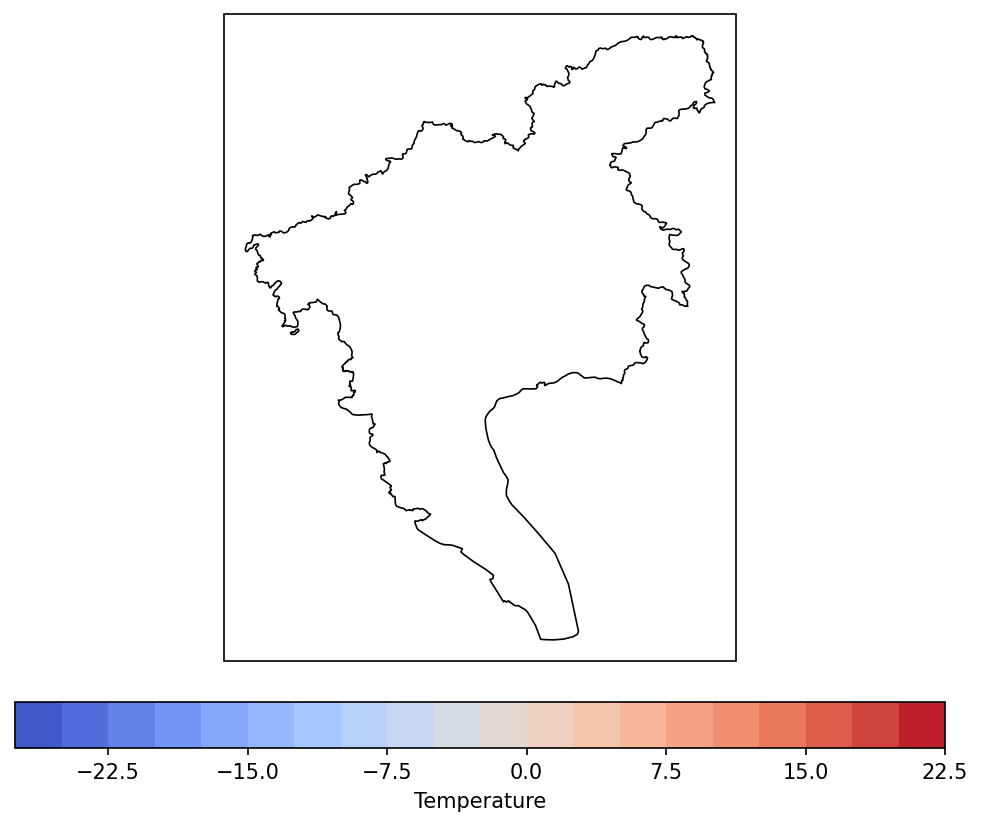

# python-cn-maps-skill

在 **matplotlib + Cartopy + cnmaps + frykit** 上绘制中国地图的**通用 Agent Skill**，适用于 **Cursor、Claude Code、Codex、GitHub Copilot、Gemini CLI、OpenCode** 等。

[English README](README.en.md) · 多平台安装：[docs/INSTALL.md](docs/INSTALL.md)

---

## 安装

```bash
git clone https://github.com/liucmys/python-cn-maps-skill.git
cd python-cn-maps-skill
```

**Windows（安装到当前项目 Cursor）：**

```powershell
.\scripts\install.ps1 -Target cursor -Scope project
```

**macOS / Linux（安装到 Claude Code 项目）：**

```bash
chmod +x scripts/install.sh
./scripts/install.sh --target claude --scope project
```

| 工具 | 项目内路径 |
|------|------------|
| Cursor | `.cursor/skills/python-cn-maps` |
| Claude Code | `.claude/skills/python-cn-maps` |
| Codex | `.codex/skills/python-cn-maps` |
| GitHub Copilot | `.github/skills/python-cn-maps` |

在对话中**附加或启用** `python-cn-maps` skill，或让 Agent 阅读 `SKILL.md`。

---

## 使用实例

复制下方**提示词**发给 Agent。各节**运行结果**为在本仓库环境中按相同需求执行后导出的 PNG，不是代码截图。

### 实例 1：全国气温填色 + 国界裁剪

**提示词：**

> 使用 python-cn-maps skill。用 cnmaps 画全国气温 contourf 填色图，按中国国界裁剪，`transform=PlateCarree`，国界用 `country="中国", level="国"`，保存为 `out.png`。

**运行结果：**


---

### 实例 2：气温填色 + 风场 + 国界裁剪

**提示词：**

> 使用 python-cn-maps skill。用 frykit 在中国范围内画 2m 气温填色和风场 quiver，用 `clip_by_cn_border` 裁剪填色与风矢量，叠加省界，保存为 `e3_temp_wind.png`。

**运行结果：**


---

### 实例 3：河南省南阳市区域高亮

**提示词：**

> 使用 python-cn-maps skill。用 cnmaps 画河南省底图，高亮南阳市（全称「河南省」「南阳市」），叠加省内市级边界，保存为 `henan_nanyang.png`。

**运行结果：**


---

### 实例 4：广州市气温填色 + 市界裁剪

**提示词：**

> 使用 python-cn-maps skill。绘制广州市气温 contourf 填色图，按广州市行政边界裁剪，使用全称「广东省」「广州市」；无观测数据时用 cnmaps 样例气温场插值到广州范围，保存为 `guangzhou_temp.png`。

**运行结果：**



---

## 仓库结构

| 文件 | 说明 |
|------|------|
| [SKILL.md](SKILL.md) | Agent 主流程 |
| [examples.md](examples.md) | E1–E8 示例代码 |
| [reference-cnmaps.md](reference-cnmaps.md) / [reference-frykit.md](reference-frykit.md) | API 速查 |
| [troubleshooting.md](troubleshooting.md) | 常见问题 |
| [docs/INSTALL.md](docs/INSTALL.md) | 各 AI 工具安装说明 |

## 许可证

MIT — [LICENSE](LICENSE)
