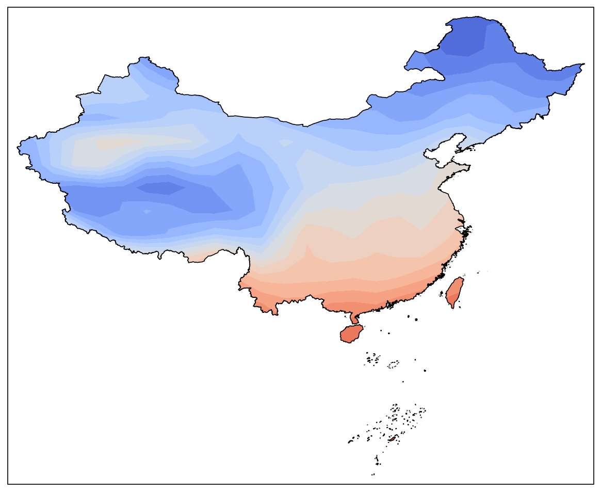
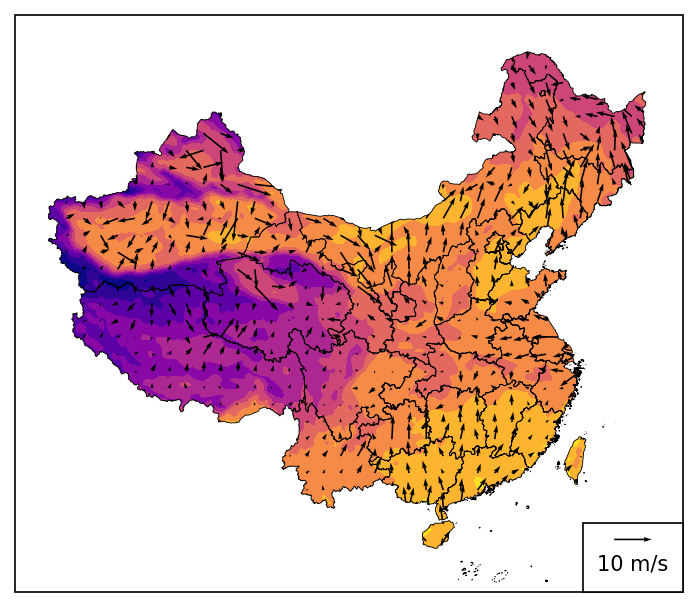
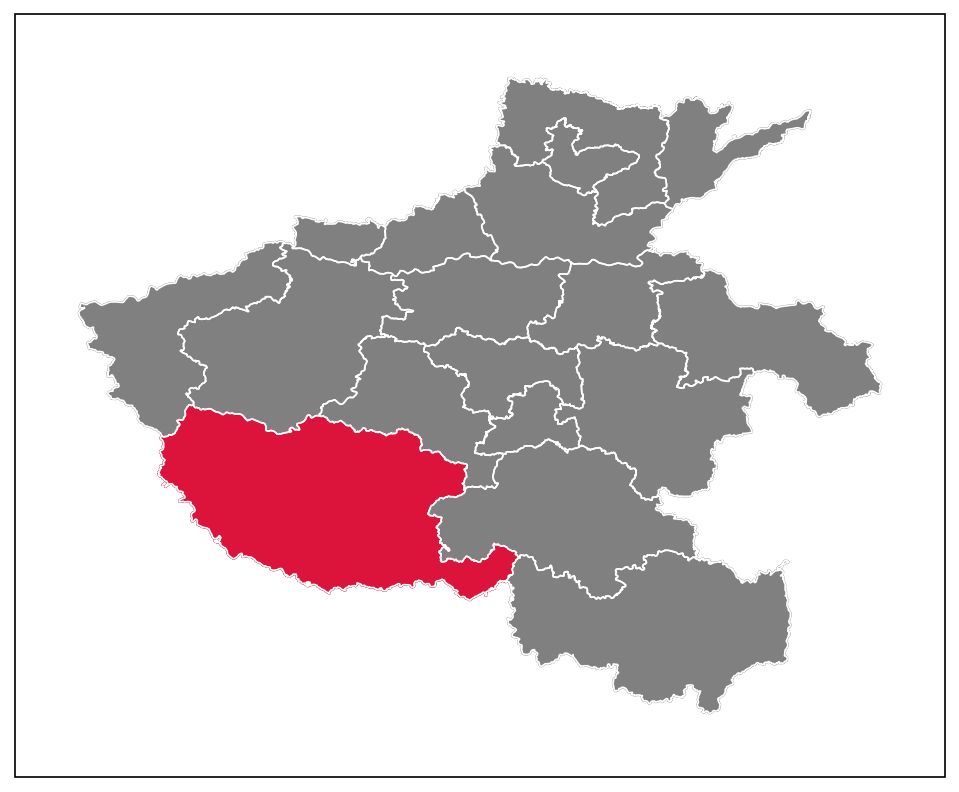

# python-cn-maps-skill

在 **matplotlib + Cartopy + cnmaps + frykit** 上绘制中国地图的**通用 Agent Skill**，适用于 **Cursor、Claude Code、Codex、GitHub Copilot、Gemini CLI、OpenCode** 等（安装方式见 [docs/INSTALL.md](docs/INSTALL.md)）。

---

## 安装

```bash
git clone https://github.com/liucmys/python-cn-maps-skill.git
cd python-cn-maps-skill
```

**Windows（安装到当前项目 Cursor）：**

```powershell
.\scripts\install.ps1 -Target cursor -Scope project
```

**macOS / Linux（安装到 Claude Code 项目）：**

```bash
chmod +x scripts/install.sh
./scripts/install.sh --target claude --scope project
```

一次写入 Cursor / Claude / Copilot 等全部项目路径：

```powershell
.\scripts\install.ps1 -Target all-project -Scope project
```

| 工具 | 项目内路径 |
|------|------------|
| Cursor | `.cursor/skills/python-cn-maps` |
| Claude Code | `.claude/skills/python-cn-maps` |
| Codex | `.codex/skills/python-cn-maps` |
| GitHub Copilot | `.github/skills/python-cn-maps` |

更多平台与全局安装：[docs/INSTALL.md](docs/INSTALL.md)

**使用方式：** 在对话中附加 / 启用 `python-cn-maps` skill，或让 Agent 阅读仓库中的 `SKILL.md`。

---

## 使用实例

下面每条为可直接复制的**提示词**。Agent 应遵循 skill 中的 `transform`、`country="中国"`、行政区别称等规则。示意图由本仓库示例脚本生成。

### 实例 1：全国气温填色 + 国界裁剪（cnmaps）

**提示词：**

```text
使用 python-cn-maps skill。用 cnmaps 画全国气温 contourf 填色图，按中国国界裁剪，必须设置 transform=PlateCarree，国界用 country="中国", level="国"。输出 out.png，并给出完整可运行 Python 脚本。
```

**效果示意：**



*对应模板：[examples.md](examples.md) E1 · 数据：`cnmaps.sample.load_temp()`*

---

### 实例 2：气温填色 + 风场 + 国界裁剪（frykit）

**提示词：**

```text
使用 python-cn-maps skill。用 frykit 在中国范围内画 2m 气温填色和风场 quiver，用 clip_by_cn_border 裁剪场和风矢量，加省界。输出 e3_temp_wind.png，完整脚本。
```

**效果示意：**



*对应模板：[examples.md](examples.md) E3 · 数据：`frykit.plot.load_test_data()`*

---

### 实例 3：河南省南阳市区域高亮（cnmaps）

**提示词：**

```text
使用 python-cn-maps skill。用 cnmaps 画河南省底图，高亮南阳市（行政区别称用全称「河南省」「南阳市」），叠加河南省内市级边界，输出 henan_nanyang.png。
```

**效果示意：**



*对应模板：[examples.md](examples.md) E2*

---

### 实例 4：广州市气温填色 + 市界裁剪（cnmaps）

**提示词：**

```text
使用 python-cn-maps skill。绘制广州市气温 contourf 填色图，按广州市行政边界裁剪，省名市名用全称「广东省」「广州市」。若无观测数据可用 cnmaps 样例气温场插值到广州范围。输出 guangzhou_temp.png。
```

*完整代码模式见 [examples.md](examples.md) 与 skill 内 Quick start。*

---

## 仓库结构

| 文件 | 说明 |
|------|------|
| [SKILL.md](SKILL.md) | Agent 主流程（工具选型、workflow、反模式） |
| [AGENTS.md](AGENTS.md) | Codex / OpenCode 入口 |
| [examples.md](examples.md) | E1–E8 可复制代码 |
| [reference-cnmaps.md](reference-cnmaps.md) / [reference-frykit.md](reference-frykit.md) | API 速查 |
| [troubleshooting.md](troubleshooting.md) | 错位、clip、命名等排错 |
| [docs/INSTALL.md](docs/INSTALL.md) | 多平台安装 |

## License

MIT — [LICENSE](LICENSE)
