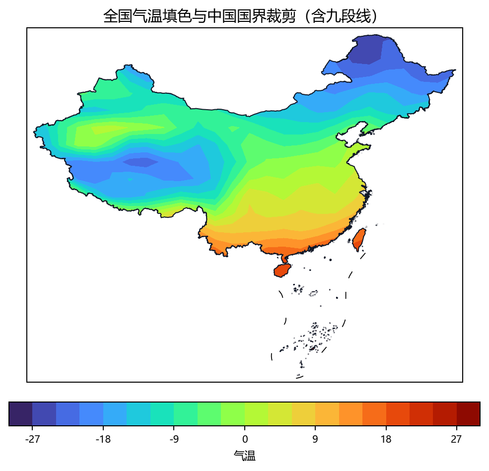
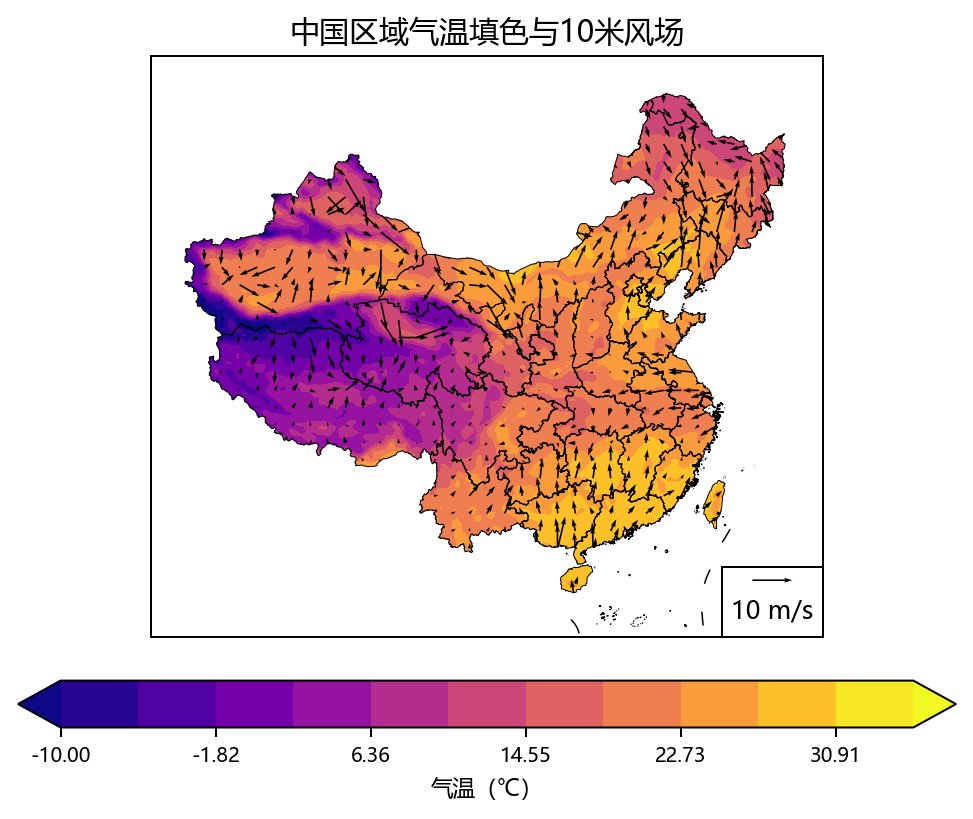
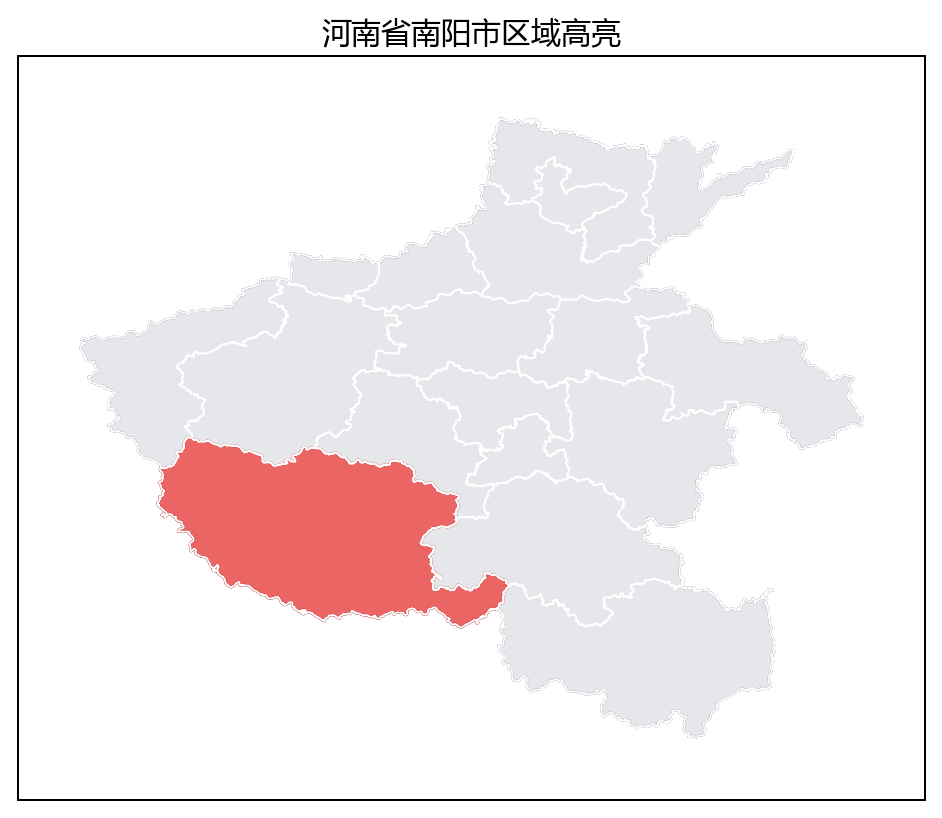
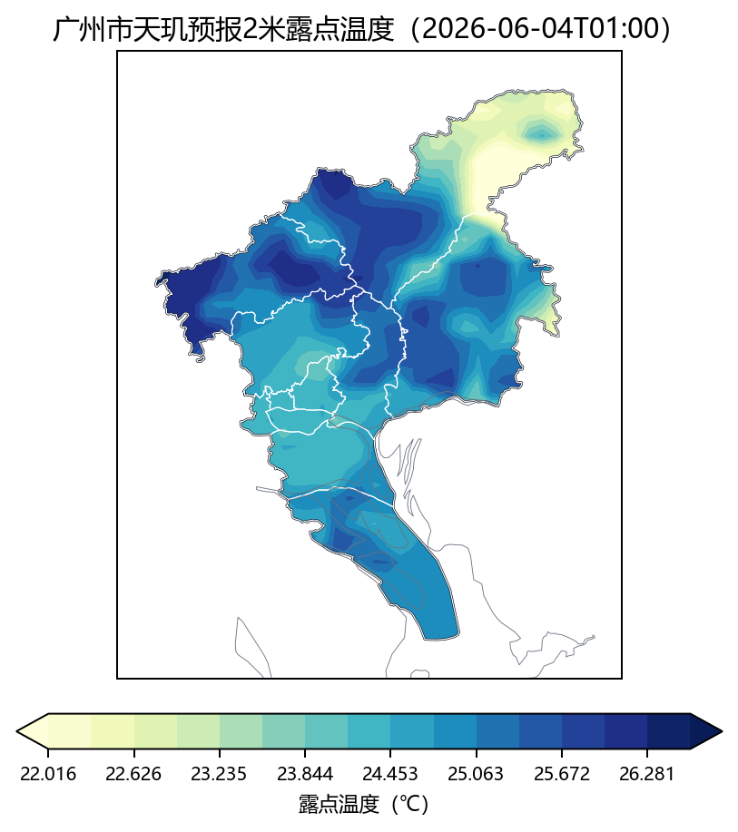
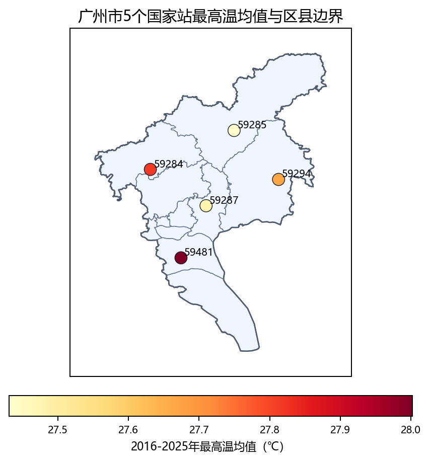
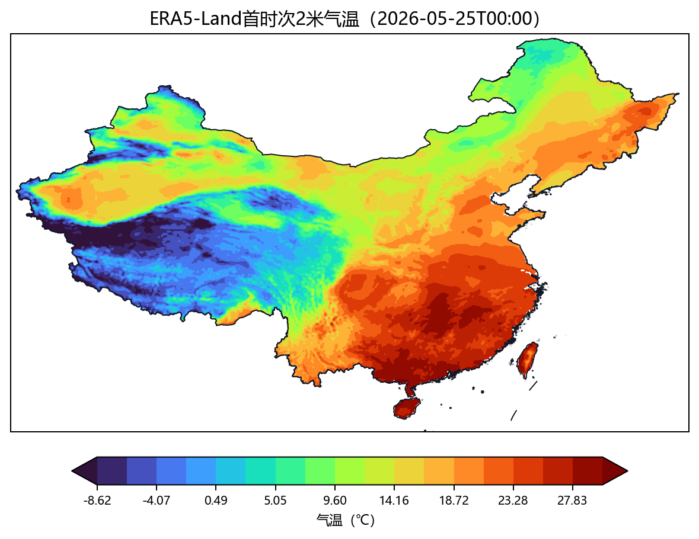
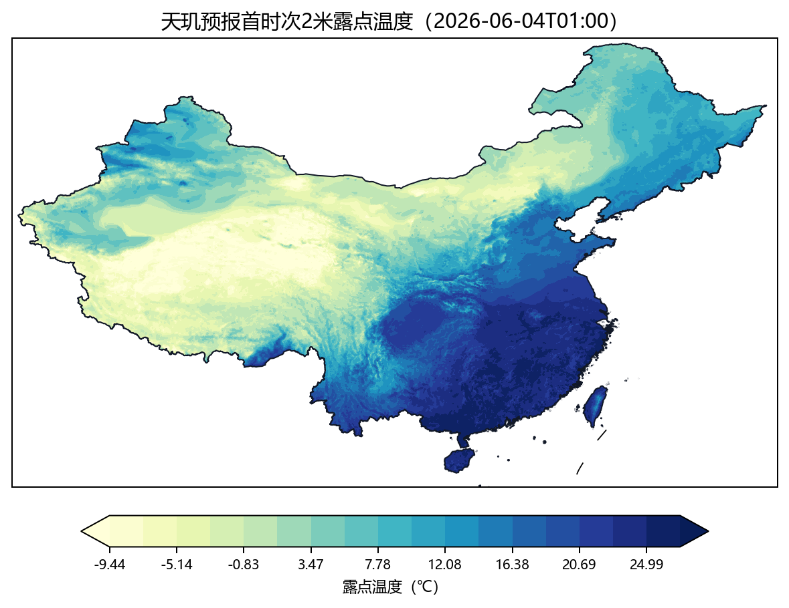

# python-cn-maps-skill

Portable agent skill for China map plotting and external meteorological data analysis.

The source skill lives at [skills/python-cn-maps](skills/python-cn-maps). Keep this repository as the publishable source; do not commit local installation folders such as `.cursor`, `.codex`, `.claude`, or `.agents`.

## What It Does

- Reads and summarizes external CSV / NetCDF / GRIB meteorological data without copying datasets into the skill.
- Supports station time-series CSV joined with an external station metadata table.
- Normalizes gridded data into `lon`, `lat`, and 2D `values`.
- Draws China-focused maps with matplotlib, Cartopy, cnmaps, and frykit.
- Supports contourf, pcolormesh, quiver, scatter, administrative boundaries, clipping, and masking.

## Layout

```text
python-cn-maps-skill/
  README.md
  AGENTS.md
  LICENSE
  skills-lock.json
  assets/
    images/
  skills/
    python-cn-maps/
      SKILL.md
      scripts/
        meteo_data.py
      references/
        examples.md
        cnmaps.md
        frykit.md
        troubleshooting.md
```

## Use

Point your agent at [skills/python-cn-maps/SKILL.md](skills/python-cn-maps/SKILL.md), or copy the `skills/python-cn-maps` folder into the skill directory required by your local agent.

## Examples

### 全国气温填色 + 国界裁剪 + 九段线

**提示词：**

> 使用 python-cn-maps skill。用 cnmaps 画全国气温 contourf 填色图，按中国国界裁剪，`transform=PlateCarree`，国界用 `country="中国", level="国"`；用 frykit 叠加九段线，保存为 `out.png`。

**结果：**



### 气温填色 + 风场 + 国界裁剪

**提示词：**

> 使用 python-cn-maps skill。用 frykit 在中国范围内画 2m 气温填色和风场 quiver，用 `clip_by_cn_border` 裁剪填色与风矢量，叠加省界，保存为 `e3_temp_wind.png`。

**结果：**



### 河南省南阳市区域高亮

**提示词：**

> 使用 python-cn-maps skill。用 cnmaps 画河南省底图，高亮南阳市，使用全称“河南省”“南阳市”，叠加省内市级边界，保存为 `henan_nanyang.png`。

**结果：**



### 广州市预报露点温度填色 + 市界裁剪

**提示词：**

> 使用 python-cn-maps skill。只读取外部天玑气象预报 NetCDF 文件 `<tianji_forecast.nc>`，变量 `dpt2m`，先输出维度、时间范围、经纬度范围、单位和广州市范围首时次 summary；再把首时次 2m 露点温度从 K 转为摄氏度，按广州市行政边界裁剪绘制 contourf，使用全称“广东省”“广州市”，保存为 `guangzhou_temp.png`。

**结果：**



### 外部 CSV 站点日数据 + 站点位置表

**提示词：**

> 使用 python-cn-maps skill。只读取外部目录 `<dataset_daily>` 和外部站点位置表 `<station_info.csv>`，不要复制数据到 skill。只选择 5 个国家站 `59284, 59285, 59287, 59294, 59481`；站点日 CSV 使用 `obtid`，位置表使用 `OBTID, lat, lon, height`；把 `-999.9` 当作缺测，按站点汇总 2016-2025 年 `maxt` 均值，和位置表按站号合并，输出匹配站点数、经纬度范围和值域 summary，并在广州市边界内绘制站点散点图，地图边界显示到区县级，保存为 `external_csv_station.png`。

**结果：**



### 外部 ERA5-Land NetCDF

**提示词：**

> 使用 python-cn-maps skill。只读取外部 NetCDF 文件 `<era5_land.nc>`，变量 `t2m`，先输出维度、时间范围、经纬度范围、单位、缺测比例和首时次 summary；再把首时次 2m 气温从 K 转为摄氏度，按中国国界裁剪绘制 contourf，并用 frykit 叠加九段线，保存为 `external_era5land_t2m.png`。

**结果：**



### 外部天玑预报 NetCDF

**提示词：**

> 使用 python-cn-maps skill。只读取外部天玑气象预报 NetCDF 文件 `<tianji_forecast.nc>`，变量 `dpt2m`，先输出维度、时间范围、经纬度范围、单位和首时次 summary；再把首时次 2m 露点温度从 K 转为摄氏度，按中国国界裁剪绘制 contourf，并用 frykit 叠加九段线，保存为 `external_tianji_dpt2m.png`。

**结果：**



## License

MIT. See [LICENSE](LICENSE).
